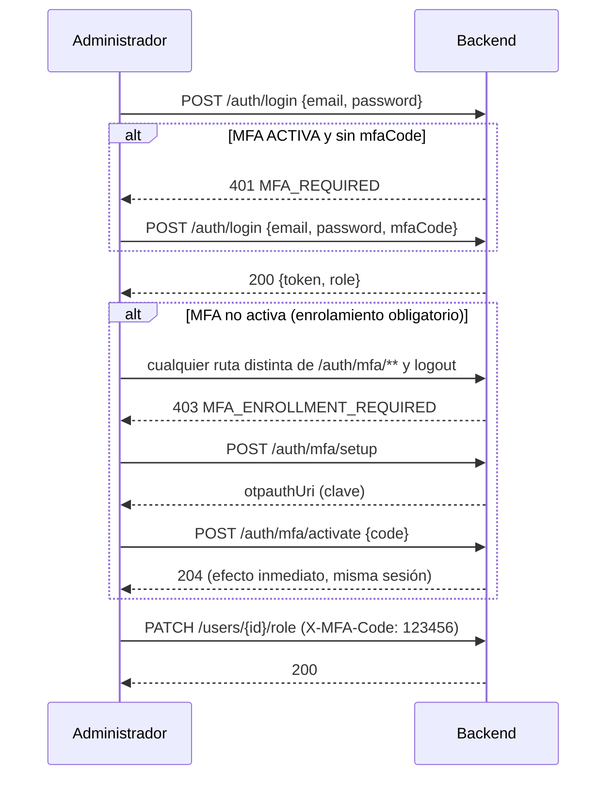

# ADR-004 — Política de autenticación multifactor (MFA)

* **Estado:** Propuesto. Ya está implementada la parte mínima en el backend (2026-10-07); falta la aprobación de los tres integrantes de Arquitectura de Software.
* **Fecha:** 2026-10-07
* **Responsable:** Simon Betancur (redacta e implementa). Revisan Juan Esteban González y Santiago Rendón.
* **Decisión:** MFA con TOTP (RFC 6238) **obligatoria para el rol ADMINISTRADOR** (enrolamiento forzoso, login en dos pasos y confirmación adicional en operaciones sensibles) y **voluntaria** para Cliente y Proveedor. Control de fuerza bruta compartido por login, MFA y operaciones sensibles.

## 1. Contexto

ADR-002 (sección 8) estableció que las cuentas administrativas requerirían MFA y que "la implementación específica del mecanismo se definirá durante el desarrollo". Los Lineamientos piden "exigir MFA para accesos administrativos o sensibles" (§3.4) y "para administración y operaciones sensibles" (§6.2). HU-02 define dos escenarios: *verificación adicional para cuentas administrativas* y *verificación adicional para operaciones sensibles*; HU-05 pide un "evento obligatorio para la creación de MFA" al ascender a alguien a Administrador.

Al cierre del Sprint 1 había un TOTP funcional (`/auth/mfa/setup` y `/activate`), pero "obligatorio" solo generaba un evento de auditoría: un administrador sin MFA operaba indefinidamente, el login no distinguía "falta el código" de "credenciales malas", no había confirmación en operaciones sensibles ni límite de intentos, y las pruebas esquivaban los vectores de la RFC. Detalle de brechas (G1–G8) en `docs/sprint-2/cierre-pendientes-sprint-1.md` §2.2.

## 2. Decisión

| # | Decisión | Estado |
|---|---|---|
| P1 | **Quién.** ADMINISTRADOR: obligatoria. CLIENTE y PROVEEDOR: voluntaria (los mismos endpoints). Se podrá ampliar según el análisis de riesgo (p. ej. proveedores). | Implementado |
| P2 | **Mecanismo.** TOTP RFC 6238 (HMAC-SHA1, 6 dígitos, paso de 30 s, tolerancia de ±1 paso), compatible con Google/Microsoft Authenticator. Sin SMS ni correo. | Implementado, verificado con los vectores oficiales de la RFC |
| P3 | **Estados.** Sin fila en `mfa` = no configurada; fila con `enabled=false` = pendiente; `enabled=true` = activa. | Implementado |
| P4 | **Enrolamiento obligatorio.** Un administrador sin MFA activa **puede iniciar sesión**, pero solo puede usar `/api/v1/auth/mfa/**` y el cierre de sesión; lo demás responde `403 MFA_ENROLLMENT_REQUIRED`. Incluye al administrador creado por `AdminBootstrapRunner` y a quien sea ascendido por HU-05. | Implementado (`MfaEnrollmentFilter`) |
| P5 | **Login en dos pasos.** Contraseña válida + MFA activa + sin `mfaCode` → `401 MFA_REQUIRED` (sin token, no cuenta como fallo). Código incorrecto → el mismo `401` genérico de credenciales inválidas. Con contraseña inválida nunca se revela que la cuenta tiene MFA. | Implementado (`AuthServiceImpl`) |
| P6 | **Confirmación en operaciones sensibles.** Header `X-MFA-Code` obligatorio en `PATCH /users/{id}/role` y `DELETE /users/{id}`: sin él `401 MFA_REQUIRED`; incorrecto `401`. | Implementado en esas dos rutas (`StepUpService`). Pendiente cuando existan: cambiar la propia contraseña (SP1-01) y reiniciar el MFA de otro (MFA-08) |
| P7 | **Fuerza bruta.** Máximo 5 fallos en 15 min por clave → `429` y bloqueo de 15 min, sin comprobar siquiera la contraseña. Claves: IP + correo (login) y administrador (confirmación). Un éxito borra el historial. El mismo mecanismo limita el registro (5 intentos por IP en 10 min; el 6.º se rechaza). | Implementado (`AttemptLimiter`, `AuthAttemptLimiter`, `RegistrationRateLimiter`) |
| P8 | **Anti-replay.** Guardar el último paso usado y rechazar códigos con paso menor o igual. | **Pendiente** (MFA-06) |
| P9 | **Secreto cifrado en reposo** (AES-256-GCM, clave por entorno). Hoy está en claro en `mfa.secret` y solo se expone en `/setup` mientras la MFA está pendiente. | **Pendiente** (MFA-07) |
| P10 | **Recuperación.** Otro administrador reinicia el MFA (`DELETE /users/{id}/mfa`, con confirmación y sin poder reiniciarse a sí mismo). Códigos de recuperación → Sprint 3. | **Pendiente** (MFA-08). Mientras tanto, runbook de operador: borrar la fila de `mfa` del usuario en la BD para que se enrole de nuevo |
| P11 | **Auditoría.** `LOGIN` (REJECTED: falta de código / código inválido), `OPERACION_SENSIBLE` (SUCCESS / REJECTED) y `ACTIVACION_MFA`; sin contraseñas, códigos ni secretos. Los rechazos se persisten aunque la operación termine en error (`noRollbackFor`). | Implementado |

### Flujo

## 3. Alternativas consideradas

| Alternativa | Por qué no |
|---|---|
| **SMS u OTP por correo** | No existe un servicio de notificaciones en el alcance; el SMS es el factor más débil (intercambio de SIM) y agrega costo y dependencia externa. |
| **WebAuthn / passkeys** | Más seguro, pero exige frontend y un alcance que no cabe en el sprint. Queda como evolución. |
| **Librería TOTP externa** | Agrega una dependencia por un algoritmo corto que ya está implementado y, ahora, verificado contra los vectores oficiales de la RFC 6238. |
| **Proveedor de identidad externo** (Keycloak, Auth0) | Cambia ADR-002 por completo y excede el alcance y el tiempo. |
| **MFA para todos los roles desde ya** | Más seguro, pero agrega fricción a Cliente y Proveedor sin un riesgo que lo justifique todavía; los endpoints ya lo permiten voluntariamente. |
| **Bloquear la cuenta del administrador hasta que active MFA** | Es lo que Sprint 1 evitó a propósito: una cuenta recién ascendida quedaría inutilizable sin forma de enrolarse. P4 mantiene el acceso, pero solo a lo necesario para enrolar. |

## 4. Consecuencias

**Positivas.** "MFA obligatorio" deja de ser solo un evento: un administrador no puede operar sin segundo factor. El flujo en dos pasos permite que un cliente sepa cuándo pedir el código sin revelar nada antes de una contraseña válida. La política cubre los dos escenarios de HU-02 y el de HU-05, y queda trazada a casos de prueba (`TC-MFA-xx`).

**Negativas y riesgos conocidos.**
- Los contadores de intentos viven en memoria: se pierden al reiniciar y no se comparten entre instancias (para varias instancias habría que moverlos a un almacén compartido, p. ej. Redis).
- Detrás del proxy de Render, `getRemoteAddr()` puede ser la IP del proxy y no la del cliente (falta `server.forward-headers-strategy`); mientras tanto la clave de login se comporta casi como "solo correo". Está anotado como pendiente de verificar en el despliegue.
- Sin anti-replay (P8) un código sirve varias veces dentro de su ventana; el secreto está en claro en la BD (P9).
- Quien robe el token de un administrador **que aún no enroló MFA** podría enrolar su propio autenticador y dejar fuera al dueño. Mitigación inmediata: enrolar al administrador del bootstrap justo después del despliegue. A futuro, pedir la contraseña también en `/setup`.
- Si el administrador pierde su autenticador, hoy solo recupera el acceso un operador con acceso a la BD (P10).

## 5. Consideraciones de seguridad

OWASP A07 (fallas de identificación y autenticación): segundo factor, límite de intentos, mensajes genéricos, sin enumeración de cuentas. A02 (fallas criptográficas): secreto sin cifrar en reposo, pendiente (P9). A09 (registro y monitoreo): rechazos auditados sin datos sensibles. Los códigos y secretos nunca se registran en logs ni en la auditoría.

## 6. Implementación y pruebas (2026-10-07)

- Código: `MfaEnrollmentFilter`, `StepUpService(Impl)`, `AuthServiceImpl` (login en dos pasos), `AttemptLimiter` / `AuthAttemptLimiter` / `RegistrationRateLimiter`, `GlobalExceptionHandler` (`MFA_REQUIRED`, `MFA_ENROLLMENT_REQUIRED`), `TotpService`.
- Pruebas: unitarias (`TotpServiceTest` con los vectores de la RFC, `AuthServiceImplTest`, `StepUpServiceImplTest`, `MfaEnrollmentFilterTest`, `AttemptLimiterTest`) e integración contra PostgreSQL real (`MfaFlowIntegrationTest`). Matriz de casos y su cobertura: `docs/sprint-2/cierre-pendientes-sprint-1.md` §2.4 y `docs/resultados-pruebas-sprint-2.md`.
- Contratos y códigos de error: `docs/api/errores-api-sprint-2.md`.

## 7. Historias de usuario relacionadas

HU-02 (*Verificación adicional para cuentas administrativas* y *para operaciones sensibles*), HU-05 (*evento obligatorio de creación de MFA*), HU-06 (control de acceso por rol).
