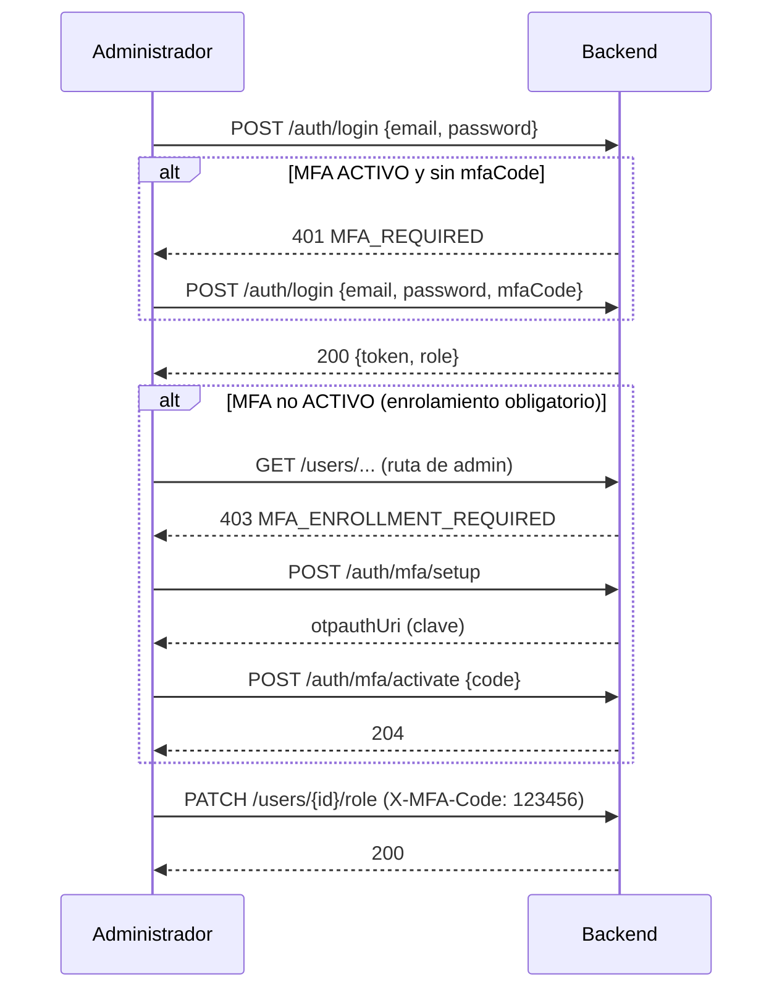

# Cierre de pendientes del Sprint 1

Lo que Sprint 1 dejó sin definir o sin cumplir al 100% contra los criterios de aceptación, y cómo se cierra con evidencia. Fecha: 2026-10-07. Fuentes: [verificación de criterios](../verificacion-criterios-aceptacion-sprint-1.md), ADR-002 §8, Lineamientos §3.4/§6.2, issues de Calidad #8–#11 y lectura directa del código.

## 1. Resumen

| ID | Pendiente | Origen | Código interno | Prioridad |
|---|---|---|---|---|
| MFA | Política sin definir y cumplimiento parcial (§2) | HU-02, HU-05, ADR-002 §8 | MFA-01..12 | Alta |
| BUG-8..11 | 4 bugs de Calidad (§3) | GitHub #8–#11 | BUG-8..11 | Alta |
| SP1-01 | No existe "cambiar mi contraseña" (con confirmación adicional) | HU-02, brecha 17a | SP1-01 | Media |
| SP1-02 | Mensaje de auto-modificación solo lo ve un administrador | HU-05, brecha 32 | SP1-02 | Baja |
| SP1-03 | Doble logout / logout sin sesión dan el mismo 401 | HU-04, brecha 27 | SP1-03 | Baja |
| SP1-04 | "El registro no autentica" no está documentado como decisión | HU-01, brecha 1 | SP1-04 | Baja |
| SP1-05 | `ReservasBackendApplicationTests` e IT dependen de un Postgres local; no corren en CI | Calidad/CI | SP1-05 | Alta |
| SP1-06 | Comentarios que citan documentos inexistentes y un Javadoc desactualizado | Deuda | SP1-06 | Baja |
| SEC-01..03 | Credenciales demo en repo público; clave de Supabase expuesta (sin confirmar rotación); ruido de "generated password" | Seguridad | SEC-01..03 | Alta |
| BD-01 | Dos modelos de BD sin conciliar (UUID vs BIGSERIAL, `RESTRICT`, `ADMIN`) | [Conciliación](../conciliacion-modelo-bd-sprint-1.md) | BD-01 | Alta (bloquea a BD) |
| CI-02 | Sonar no habilitado (Sprint 1 ya lo pedía) | Rúbrica | CI-02 | Alta |

> **Qué llega a Azure (política del 2026-10-07):** los códigos de esta tabla son el *checklist interno* (`PENDIENTES` en `azure-boards/backlog_data.py`); Azure solo lleva tareas por componente. Aquí corresponden a: `SEG-01` (MFA-01..04, 09..11), `SEG-02` (MFA-05: control de intentos), `PLT-02` (CI-02: Sonar) y `ARQ-02` (BD-01: convenciones de BD). Los bugs (BUG-8..11), las brechas `SP1-nn`, la higiene `SEC-nn` y las extensiones de MFA (MFA-06..08, 12) **no generan tarea de Azure**: los bugs se cierran con `Fixes #n` en el PR.
>
> **Estado al 2026-10-07:** hechos BUG-8..11, MFA-01..05 y 09..10, SP1-05, SP1-07 y SP1-08 (ver §2.7 y §3); parciales MFA-11 y MFA-12. Siguen pendientes MFA-06..08, SP1-01..04 y 06, SEC-01..04, BD-01 y CI-02. El avance vivo está en `AVANCE` de `azure-boards/backlog_data.py` (y se ve en `azure-boards/tareas-sprint-2.md`).

## 2. MFA

### 2.1 Estado actual (verificado en código)

| Aspecto | Implementación |
|---|---|
| Algoritmo | TOTP RFC 6238 a mano (`TotpService`): HMAC-SHA1, 6 dígitos, paso de 30 s, ventana ±1 paso (`CLOCK_DRIFT_STEPS = 1`), secreto de 160 bits en Base32 |
| Almacenamiento | Tabla `mfa` (`user_id` único, `secret` VARCHAR(64) **en texto plano**, `enabled`, `created_at`) — V4 |
| Enrolamiento | `POST /api/v1/auth/mfa/setup` (autenticado; idempotente; devuelve `otpauthUri`) y `POST /api/v1/auth/mfa/activate {code}` → 204. Cualquier rol puede activarla |
| Login | Solo exige código si el rol es `ADMINISTRADOR` **y** `mfa.enabled` (`AuthServiceImpl:70-75`); sin código o con código malo → 401 genérico + auditoría `REJECTED` |
| Ascenso a ADMIN | `triggerMandatorySetup` crea la fila pendiente y audita `ACTIVACION_MFA/PENDING`; **no obliga a nada** |
| Admin del bootstrap | `AdminBootstrapRunner` no crea fila MFA |
| Pruebas | `TotpServiceTest` (8), `MfaServiceImplTest` (9), `AuthServiceImplTest` (3 de MFA). El test de `TotpService` **evitó a propósito** los vectores de la RFC, así que la interoperabilidad con Google/Microsoft Authenticator **no está demostrada** |

### 2.2 Brechas frente a los criterios

| ID | Brecha | Criterio / norma |
|---|---|---|
| G1 | El enrolamiento "obligatorio" solo genera un evento: un admin sin MFA opera indefinidamente | HU-05 ("evento obligatorio para la creación de MFA"); Lineamientos §3.4 |
| G2 | Sin confirmación adicional en operaciones sensibles (`PATCH /users/{id}/role`, `DELETE /users/{id}`, cambiar contraseña) | HU-02, escenario "Verificación adicional para operaciones sensibles"; Lineamientos §6.2 |
| G3 | Sin límite de intentos en login ni en el código MFA (10⁶ combinaciones × 3 pasos) | OWASP A07 |
| G4 | Sin anti-replay: un código sirve varias veces dentro de su ventana | OWASP A07 |
| G5 | Secreto MFA en claro en la BD | OWASP A02 |
| G6 | Sin recuperación si el administrador pierde el autenticador | Operación |
| G7 | El 401 es idéntico para "falta el código" y "credenciales malas": un cliente no sabe que debe pedir el código (el flujo en dos pasos no está definido) | HU-02 ("debe solicitarle completar ese paso adicional") |
| G8 | Pruebas: sin vectores RFC, sin prueba de integración del flujo completo, `MfaController` 0% de cobertura | Calidad |

### 2.3 Política propuesta (→ ADR-004, decidir el Día 1)

Respaldo: Lineamientos §3.4 *"Exigir MFA para accesos administrativos o sensibles; extenderlo a otros usuarios según el análisis de riesgo"* y §6.2 *"Exigir MFA para administración y operaciones sensibles"*; ADR-002 §8 dejó el mecanismo "por definir durante el desarrollo".

| # | Decisión | Detalle |
|---|---|---|
| P1 | **Quién** | ADMINISTRADOR: obligatoria. CLIENTE/PROVEEDOR: voluntaria (el endpoint ya lo permite). Ampliación futura según análisis de riesgo (p. ej. proveedores) |
| P2 | **Mecanismo** | TOTP (RFC 6238), compatible con Google/Microsoft Authenticator; sin SMS ni correo (no hay servicio de notificaciones y SMS es débil) |
| P3 | **Estados** | `NO_CONFIGURADO` (sin fila) → `PENDIENTE` (fila con `enabled=false`) → `ACTIVO`; el reset lleva de nuevo a `NO_CONFIGURADO` |
| P4 | **Enrolamiento obligatorio** | Un ADMIN en estado ≠ `ACTIVO` puede iniciar sesión pero solo usar `/auth/mfa/*` y `/auth/logout`; todo lo demás → `403 MFA_ENROLLMENT_REQUIRED`. Incluye al admin creado por `AdminBootstrapRunner`. Así no se bloquea la cuenta (decisión de Sprint 1) y "obligatorio" deja de ser solo un evento |
| P5 | **Login en dos pasos** | Contraseña válida + MFA activo + sin código → `401 MFA_REQUIRED` (sin token). Código erróneo → 401 genérico igual que credenciales inválidas (no se revela cuál falló). Esto solo se informa **después** de una contraseña válida |
| P6 | **Step-up en operaciones sensibles** | Header `X-MFA-Code` obligatorio en `PATCH /users/{id}/role`, `DELETE /users/{id}`, `DELETE /users/{id}/mfa`. Para "cambiar mi contraseña" (cualquier usuario): contraseña actual + código si tiene MFA activa |
| P7 | **Fuerza bruta** | Máx. 5 fallos por IP+correo en 15 min → `429` y bloqueo de 15 min; se comparte entre login, MFA y step-up; mensajes genéricos |
| P8 | **Anti-replay** | Guardar `last_used_step`; rechazar códigos con paso ≤ al último usado (migración) |
| P9 | **Secreto** | Cifrado en reposo con AES-256-GCM, clave `MFA_ENCRYPTION_KEY` por entorno (Render + `.env.example`); nunca en logs, auditoría ni respuestas salvo `setup` mientras esté `PENDIENTE` |
| P10 | **Recuperación** | Sprint 2: otro administrador resetea (`DELETE /users/{id}/mfa`, con step-up; no puede resetearse a sí mismo) + runbook operativo. Códigos de recuperación → Sprint 3 |
| P11 | **Auditoría** | `ACTIVACION_MFA` (PENDING/SUCCESS/REJECTED), `LOGIN` REJECTED "código MFA inválido", `OPERACION_SENSIBLE` en step-up y reset; sin secretos ni códigos |



### 2.4 Matriz de pruebas (cierra G1–G8)

Nivel: **U** unitaria (Mockito, AAA) · **I** integración (Testcontainers, corre en CI) · **M** manual/Postman · **S** seguridad. Los IDs `TC-MFA-xx` son provisionales; Calidad asigna los `CP-*` definitivos.

| ID | Nivel | Caso | Resultado esperado | Criterio |
|---|---|---|---|---|
| TC-MFA-01 | U | **Vectores RFC 6238** (SHA1, secreto ASCII `12345678901234567890`; códigos de 6 dígitos = últimos 6 de los de 8): paso 1 → `287082`; 37037036 → `081804`; 37037037 → `050471`; 41152263 → `005924`; 66666666 → `279037`; 666666666 → `353130` | `generateCode(secret, paso)` coincide en los 6 | G8 (interoperabilidad) |
| TC-MFA-02 | U | Ventana: código del paso −1 y +1 | Aceptado; paso ±2 rechazado | HU-02 |
| TC-MFA-03 | U | Formato: `null`, vacío, 5 y 7 dígitos, letras | Rechazado | HU-02 |
| TC-MFA-04 | U | Secreto generado | 32 caracteres Base32, distinto en cada llamada | — |
| TC-MFA-05 | U | Replay: mismo código dos veces en su ventana | La segunda vez rechazada (P8) | G4 |
| TC-MFA-06 | U | `setup` sin fila previa | Crea fila `PENDIENTE`; `otpauthUri` con issuer, `digits=6`, `period=30`; segunda llamada devuelve el mismo secreto | HU-02 |
| TC-MFA-07 | U | `setup` con MFA activa | `{enabled:true}` sin secreto | G5 |
| TC-MFA-08 | U | `activate` sin `setup` | 400 | HU-02 |
| TC-MFA-09 | U | `activate` con código malo / bueno | 400 sin habilitar / 204 + auditoría `SUCCESS` | HU-02 |
| TC-MFA-10 | U | `triggerMandatorySetup` | Crea fila pendiente + evento `PENDING`; no sobrescribe una existente | HU-05 |
| TC-MFA-11 | U/I | Admin con MFA activo + contraseña + código válidos | 200 con token | HU-02 |
| TC-MFA-12 | U/I | … sin código | 401 `MFA_REQUIRED`, sin token (P5) | G7 |
| TC-MFA-13 | U/I | … código erróneo | 401 genérico + auditoría `REJECTED` y cuenta un intento | HU-02 |
| TC-MFA-14 | U/I | Contraseña inválida + código válido | 401 genérico; no revela que hay MFA | HU-02 |
| TC-MFA-15 | U/I | Cliente/Proveedor sin MFA | Login sin código; un código enviado se ignora | HU-02 |
| TC-MFA-16 | I | Admin con MFA pendiente | Login 200; ruta de admin → 403 `MFA_ENROLLMENT_REQUIRED`; `/auth/mfa/*` accesible; tras `activate` la ruta de admin → 200 | HU-05, G1 |
| TC-MFA-17 | I | Admin creado por el bootstrap (sin fila MFA) | Mismo comportamiento que TC-MFA-16 | G1 |
| TC-MFA-18 | I | `PATCH /users/{id}/role` sin / con malo / con buen `X-MFA-Code` | 401 `MFA_REQUIRED` / 401 / 200 | HU-02 (operaciones sensibles) |
| TC-MFA-19 | I | `DELETE /users/{id}` ídem | ídem | HU-02 |
| TC-MFA-20 | I | Código reutilizado en step-up | 401 | G4 |
| TC-MFA-21 | I | 5 códigos incorrectos seguidos | 429 y bloqueo 15 min; luego permitido | G3 |
| TC-MFA-22 | S | Mismo mensaje para cuenta existente e inexistente | Sin enumeración de usuarios | OWASP A07 |
| TC-MFA-23 | S | Secreto en logs, auditoría y respuestas | Ausente (salvo `setup` pendiente); cifrado en BD | G5 |
| TC-MFA-24 | I | Reset de MFA por otro admin (con step-up) | Fila eliminada; el usuario debe re-enrolar; auditoría | G6 |
| TC-MFA-25 | I | Admin intenta resetear su propio MFA | 403 | G6 |
| TC-MFA-26 | I | Dos `activate` simultáneos | Estado consistente (una sola fila activa) | — |
| TC-MFA-27 | M | Interoperabilidad con Google/Microsoft Authenticator (clave manual) | Códigos aceptados; desfase de ±30 s aceptado, ±2 min rechazado | G8 |
| TC-MFA-28 | M | Flujo completo en el entorno de pruebas (Render) con Postman | Evidencia en `docs/sprint-2/evidencias/` | todos |

**Cambiar contraseña (SP1-01):** `TC-PWD-01` contraseña actual incorrecta → 401 · `-02` nueva no cumple la política → 400 · `-03` nueva igual a la actual → 400 · `-04` éxito → 204, **todas las sesiones revocadas**, auditoría `CAMBIO_CONTRASENA` · `-05` con MFA activa exige código · `-06` sin sesión → 401 · `-07` límite de intentos · `-08` la contraseña no aparece en logs.

### 2.5 Procedimiento de cierre de MFA (checklist)

1. ADR-004 aprobado por los tres de Arquisoft (con alternativas, consecuencias, responsable y fecha). **MFA-01**
2. Implementación P4–P9 en ramas cortas; revisión de otra pista. **MFA-02..08**
3. TC-MFA-01..26 automatizados; TC-MFA-01 prueba la conformidad con la RFC. **MFA-09, MFA-10**
4. TC-MFA-27/28 manuales con evidencia (capturas de la app autenticadora, de Postman y del log sin secretos). **MFA-11**
5. Guías publicadas (administrador y QA). **MFA-12**
6. Swagger documenta `MFA_REQUIRED`, `MFA_ENROLLMENT_REQUIRED` y el header `X-MFA-Code`.
7. Calidad ejecuta su matriz y cierra; Azure en `Closed`.

### 2.6 Guía operativa — configurar MFA de un administrador

1. Iniciar sesión (`POST /api/v1/auth/login`) y copiar el `token`.
2. `POST /api/v1/auth/mfa/setup` con `Authorization: Bearer <token>`. La respuesta trae `otpauthUri` (`otpauth://totp/ReservasPlataforma:<correo>?secret=<CLAVE>&issuer=ReservasPlataforma&digits=6&period=30`).
3. En Google/Microsoft Authenticator: *Agregar cuenta → Ingresar clave de configuración*; nombre = el correo, clave = el valor de `secret`, tipo **basado en tiempo**. (Un QR se puede generar con cualquier herramienta local a partir del `otpauthUri`; no pegarlo en sitios web.)
4. `POST /api/v1/auth/mfa/activate` con `{"code":"<6 dígitos de la app>"}` → `204`.
5. A partir de ahí, el login exige `mfaCode` y las operaciones sensibles exigen `X-MFA-Code`.
6. Si se pierde el autenticador: otro administrador ejecuta el reset (MFA-08) o, en emergencia, el operador borra la fila de `mfa` de ese usuario en la BD (runbook).

**Calcular el código sin teléfono (QA / Postman / pruebas)** — verificado contra los vectores de la RFC:

```python
import base64, hashlib, hmac, struct, sys, time
def totp(secret_b32, t=None, step=30, digits=6):
    key = base64.b32decode(secret_b32.upper() + "=" * (-len(secret_b32) % 8))
    h = hmac.new(key, struct.pack(">Q", int((t or time.time()) // step)), hashlib.sha1).digest()
    o = h[-1] & 0x0F
    return str((struct.unpack(">I", h[o:o + 4])[0] & 0x7FFFFFFF) % 10**digits).zfill(digits)
print(totp(sys.argv[1]))      # python totp.py <CLAVE_BASE32>
```

### 2.7 Estado de implementación (2026-10-07)

Política: [ADR-004](../arquitectura/adr/ADR-004-politica-mfa.md) (estado *Propuesto*: falta que la aprueben los tres de Arquisoft). Implementado el mínimo: **P1–P7 y P11** (brechas G1, G2, G3 y G7 cerradas, y G8 en lo automatizable). Pendiente: **P8** anti-replay (G4, MFA-06), **P9** cifrado del secreto (G5, MFA-07) y **P10** recuperación (G6, MFA-08). Contratos y códigos de error: [errores-api-sprint-2.md](../api/errores-api-sprint-2.md).

| Caso | Automatizado en | Estado |
|---|---|---|
| TC-MFA-01 vectores RFC 6238 | `TotpServiceTest.debeCoincidirConLosVectoresDeLaRfc6238` (6 vectores, también por `verify`) | ✔ el `TotpService` de producción coincide con la RFC |
| TC-MFA-02 / 03 / 04 ventana, formato, secreto | `TotpServiceTest` | ✔ |
| TC-MFA-05 / 20 anti-replay | — | pendiente (MFA-06) |
| TC-MFA-06 / 07 / 08 / 09 / 10 setup y activate | `MfaServiceImplTest`, `MfaFlowIntegrationTest` | ✔ |
| TC-MFA-11 / 12 / 13 / 14 / 15 login en dos pasos | `AuthServiceImplTest`, `MfaFlowIntegrationTest` | ✔ |
| TC-MFA-16 / 17 enrolamiento obligatorio (incluye el admin del bootstrap) | `MfaEnrollmentFilterTest`, `MfaFlowIntegrationTest`, verificación E2E | ✔ |
| TC-MFA-18 / 19 confirmación en rol y eliminación | `StepUpServiceImplTest`, `UserControllerSecurityTest`, `MfaFlowIntegrationTest` | ✔ |
| TC-MFA-21 bloqueo tras 5 códigos malos | `AttemptLimiterTest`, `MfaFlowIntegrationTest` (login y confirmación) | ✔ |
| TC-MFA-22 sin enumeración de cuentas | `MfaFlowIntegrationTest.elBloqueoPorIntentosNoPermiteSaberSiLaCuentaExiste` | ✔ |
| TC-MFA-23 secreto en logs, auditoría y respuestas | `MfaFlowIntegrationTest.losRechazosDeMfaQuedanAuditadosSinElCodigo` (auditoría), `setup` con MFA activa no lo reexpone | parcial: el cifrado en la BD está pendiente (MFA-07); no se revisaron los logs de forma automática |
| TC-MFA-24 / 25 reinicio por otro administrador | — | pendiente (MFA-08) |
| TC-MFA-26 concurrencia | `MfaFlowIntegrationTest.dosSetupSimultaneosNuncaDan500YDejanUnaSolaConfiguracion` | ✔ |
| TC-MFA-27 app autenticadora real (Google/Microsoft) | — | **no realizado**: solo se comprobó con el script de TOTP de §2.6 contra la app corriendo (28/28) |
| TC-MFA-28 flujo completo en el entorno de pruebas (Render) con Postman | — | **no realizado** |

## 3. Bugs reportados por Calidad (GitHub Issues)

Plantilla de reporte: `.github/ISSUE_TEMPLATE/bug_report.yml` (etiqueta `bug`). Hoy hay 4 issues abiertos, todos sobre HU-01 y afectando también HU-02/03. Proceso: **prueba en rojo → corrección → PR con `Fixes #n` → CI verde → despliegue al entorno de pruebas → comentario con evidencia en el issue → Calidad reverifica y cierra** (los issues los cierra Calidad, no nosotros; los bugs no generan tarea de Azure).

**Estado al 2026-10-07: los cuatro están corregidos en el código y con pruebas de regresión; falta el PR, el despliegue y que Calidad los reverifique.** Cada "antes" se midió, no se dedujo:

| Issue | Antes (medido) | Después | Regresión |
|---|---|---|---|
| #8 | Con la clase original de `git HEAD`, el intento 6 crea la cuenta y recién el 7 da 429 | El intento 6 da 429 y no crea la cuenta (también contra la app real) | `AttemptLimiterTest` (incl. 20 hilos), `RateLimitersTest`, `RegistrationRateLimitIntegrationTest` |
| #9 | Sin `@Size`: un nombre o correo de 300 caracteres llegaba a la BD / a BCrypt | 400 con el campo señalado; tope de 72 bytes para la contraseña | `RequestLengthValidationTest`, `PasswordValidatorTest`, `ApiErrorHandlingIntegrationTest` |
| #10 | Sin el manejador, dos registros simultáneos dieron `[500, 201]` en la primera ronda | `[201, 409]` en las 5 rondas, con el mismo mensaje que si la cuenta ya existiera | `RegistrationConcurrencyIntegrationTest` |
| #11 | Sin los manejadores, 12 de 19 casos (cuerpo vacío ×3, JSON roto ×3, 415 ×3, 405, UUID inválido, 404) daban 500 | 400 / 404 / 405 / 415 con el formato `ApiError` | `GlobalExceptionHandlerTest`, `ApiErrorHandlingIntegrationTest` |

Hallazgo adicional al implementar (**SP1-07**): los rechazos que el servicio audita (`REJECTED`) antes de lanzar la excepción **se perdían** porque el rollback revertía también el evento; no lo reportó Calidad. Corregido con `noRollbackFor` en login, registro, aprovisionamiento y cambio de rol (`AuditPersistenceIntegrationTest`: 3 de 4 fallaban antes).

### #8 — El sexto intento de registro crea la cuenta (CP-HU01-02-E1) · severidad alta
- **Causa raíz:** `RegistrationRateLimiter.registerAttempt` bloquea con `attempts > MAX_ATTEMPTS` (línea 62). Cuando llega el 6.º intento, `isBlocked()` ya devolvió `false` y recién ahí el contador pasa a 6; el 7.º es el primero rechazado. Además `isBlocked()` + `registerAttempt()` no son atómicos (dos solicitudes simultáneas pasan ambas) y hay tres mapas separados.
- **Corrección:** un solo estado por origen y una operación atómica `tryRegisterAttempt(origin)` (con `ConcurrentHashMap.compute`): los intentos 1–5 se permiten, el 6.º se rechaza y fija el bloqueo de 15 min; la ventana se reinicia a los 10 min. Se comparte entre `/users` y `/providers` (ya es el mismo bean) y se generaliza para login/MFA (MFA-05).
- **Regresión:** exactamente 5 permitidos y el 6.º → 429; 10 hilos simultáneos → exactamente 5 permitidos; fin de ventana; fin de bloqueo; orígenes independientes; el 429 incluye mensaje claro. Cierre: la tabla de evidencia del issue (intentos 1–6) repetida contra el entorno de pruebas.

### #9 — Sin validación de longitud (nombre, contraseña, correo)
- **Causa raíz:** los DTO validan formato, no tamaño. Un valor largo llega a `VARCHAR(150)`/`(255)` (error de BD → 500) o a BCrypt, que solo usa los primeros 72 bytes y es costoso con entradas enormes. Aplica también a `RegisterProviderRequest` (HU-03) y `LoginRequest` (HU-02).
- **Corrección (implementada):** `@Size` — nombre, correo y negocio ≤ 150; contraseña ≤ 72 caracteres y ≤ 72 bytes en UTF-8 (`PasswordValidator`); `mfaCode`/`code` ≤ 10 y rol ≤ 30; mensajes por campo en `fields`. **Pendiente (OWASP-02):** tope de tamaño del cuerpo de la petición (413).
- **Regresión:** límite exacto OK y límite+1 → 400 por campo, en los tres DTO. Cierre: la petición del issue con cadenas > 255 devuelve 400 con los campos señalados.

### #10 — Registro concurrente con el mismo correo devuelve 500 en lugar de 409 · severidad alta
- **Causa raíz:** patrón comprobar-y-luego-insertar (`existsBy…` → `save`) sin atomicidad. La restricción única `uk_users_email` sí protege la BD, pero la violación sale como `DataIntegrityViolationException` (SQLSTATE 23505), que no tiene manejador y cae en `@ExceptionHandler(Exception)` → 500. Con UUID generado por la aplicación, Hibernate puede diferir el INSERT hasta el commit, así que la excepción aparece fuera del `try` del servicio.
- **Corrección (implementada):** manejador global que traduce `DataIntegrityViolationException` por SQLSTATE y nombre de restricción: 23505 `uk_users_email` → 409 "correo en uso"; `uk_users_phone` → 409 "celular en uso"; otras únicas → 409 genérico; 22001 (valor demasiado largo) → 400; el resto sigue siendo 500 sin detalles. Se descartó `saveAndFlush`: el error aparece al confirmar la transacción y el manejador lo traduce igual; además, un rechazo por violación no se puede auditar dentro de la transacción ya fallida. **Pendiente para HU-22:** 23P01 (exclusión de reservas) → 409 "horario no disponible".
- **Regresión:** prueba de integración con dos hilos y `CyclicBarrier` (mismo correo, distinto celular, y el caso inverso): una respuesta 201 y una 409, una sola fila. Cierre: repetir el escenario del issue en el entorno de pruebas.

### #11 — Cuerpo vacío devuelve 500 en lugar de 400 (HU-01/02/03)
- **Causa raíz:** `HttpMessageNotReadableException` (cuerpo vacío o JSON mal formado) no tiene manejador y cae al genérico. `{}` sí da 400 porque entra por la validación de campos. La misma omisión afecta a: tipo de contenido (415), método (405), ruta inexistente (404), y parámetro o UUID de ruta inválido (400) — con una sesión válida, `GET /api/v1/users/abc` también da 500 (se deduce del manejador genérico; confirmarlo en la prueba de regresión).
- **Corrección:** manejadores específicos en `GlobalExceptionHandler` para esas excepciones (mensaje "El cuerpo de la solicitud es inválido o está vacío", etc.) manteniendo el formato `ApiError`; el genérico queda solo para errores realmente inesperados.
- **Regresión:** por endpoint (`/users`, `/providers`, `/auth/login`): sin cuerpo, `{}` y JSON roto → 400; `Content-Type` incorrecto → 415; método incorrecto → 405; UUID inválido → 400; ruta inexistente → 404. Cierre: tabla del issue (3 endpoints) en 400.

## 4. Brechas menores de criterios (SP1-01..06)

| ID | Diseño resumido |
|---|---|
| SP1-01 | `PUT /api/v1/users/me/password {currentPassword, newPassword, mfaCode?}`: valida contraseña actual, política y que la nueva sea distinta; límite de intentos; revoca todas las sesiones (re-login); evento `CAMBIO_CONTRASENA` (se agrega al enum; no requiere migración porque se guarda como texto) |
| SP1-02 | Evaluar `requester == target` **antes** del chequeo de rol para que Cliente/Proveedor reciban "No puede modificar su propio rol" (hoy `@PreAuthorize` lo bloquea antes con el mensaje genérico) |
| SP1-03 | Decidir con Calidad: mantener 401 (el filtro ya trata la sesión revocada como no autenticada) y documentarlo, o permitir logout idempotente (204) |
| SP1-04 | Nota en `endpoints-sprint-1.md`/ADR: el AC de HU-01 es un OR; el registro redirige al login |
| SP1-05 | `AbstractIntegrationTest` con contenedor Postgres compartido (singleton) y `@DynamicPropertySource`; `ReservasBackendApplicationTests` y las IT la extienden; sin depender de `localhost:5432` |
| SP1-06 | Quitar referencias a `HU-01-checklist.md`/`matriz-actualizaciones.md` y corregir el Javadoc de `IdentityServiceImpl` |

## 5. Higiene de seguridad

- **SEC-01:** `docs/guia-prueba-aplicacion-desplegada.md` publica `admin@example.com` y su contraseña en un repositorio **público**; cualquiera puede iniciar sesión como administrador en el despliegue y borrar usuarios. Rotar la contraseña, quitarla de los documentos (entregarla por canal privado) y, con MFA-02, exigir MFA al admin.
- **SEC-02:** la contraseña de Supabase expuesta en `5ae30bd` sigue en el historial público; confirmar con Santiago que se rotó.
- **SEC-03:** `UserDetailsServiceAutoConfiguration` imprime una contraseña generada en cada arranque; inofensiva (no hay `httpBasic`/`formLogin`), pero evitable con un `UserDetailsService` vacío.

## 6. Cómo se "cierra" cualquier requisito (DoD operativo)

1. **Trazar:** criterio de aceptación → casos de prueba (`CP-HUnn-xx`) → regla de negocio → endpoint (matriz de [trazabilidad](azure-boards/trazabilidad-sprint-2.md)).
2. **Implementar** en una rama corta (`feature/<HU>-<desc>` o `fix/<BUG>-<desc>`).
3. **Probar:** unitarias (AAA) con ≥ 65% del código nuevo; integración en CI; requests en Postman.
4. **Revisar:** PR con checklist de DoD; revisor de otra pista; Quality Gate y controles de seguridad en verde.
5. **Verificar** en el entorno de pruebas (logs sin datos sensibles) y guardar **evidencia**.
6. **Actualizar** Azure (Task → `Closed`), el issue (`Fixes #n`), Swagger, ADR/diagramas y migraciones.
7. **Validar** con Calidad (ellos cierran bugs y HU).
